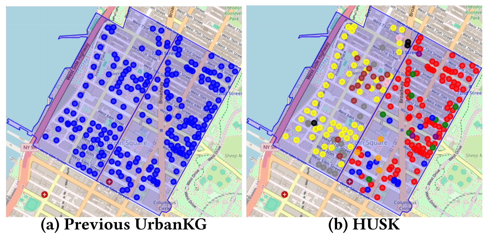

<p style="text-align:center; font-size:72px; font-weight:bold;">
HUSK
</p>

A Hierarchically Structured Urban Knowledge Graph Dataset for Multi-Level Spatial Tasks.

## 1. Overview



HUSK is a hierarchically structured urban knowledge graph dataset designed for multi-level spatial tasks. It covers entities such as POIs, roads, and regions in New York City and Chicago, and introduces "Functional Zones" as an intermediate layer to bridge micro-level POIs and macro-level administrative areas. The figure above illustrates how the added functional zones are reflected within areas. Compared to existing UrbanKG datasets, HUSK captures urban semantics and spatial relationships at a finer granularity, enabling a wide range of tasks such as crime prediction, taxi demand forecasting, and new store recommendation, with significant performance improvements across multiple benchmark models.

## 2. Installation
You can create and activate the environment required to run the project using the following commands.

```
conda create -n python3.7 HUSK
conda activate HUSK
pip install -r requirements.txt
```

Please ensure that you have cloned the project and entered the directory before running the above commands.

## 3. Dataset

The datasets used in this work are derived from two open-source datasets in the UUKG project, collected from New York and Chicago. The complete data sources can be found on [Google Drive](https://drive.google.com/drive/folders/1egTmnKRzTQuyW_hsbFURUonGC-bJmBHW?usp=sharing), respectively.

Below are detailed explanations of how to preprocess and use these data.

#### 3.1 UrbanKG Data

| Dataset | POI   | Road   | Junction | FZ   | Area | Borough |
| ------- | ----- | ------ | -------- | ---- | ---- | ------- |
| NYC     | 62450 | 110919 | 62627    | 1271 | 260  | 5       |
| CHI     | 31573 | 71578  | 37342    | 190  | 77   | 6       |

##### Guidance on data usage and processing

All raw data is stored in the **'./Meta_data'** folder. You can process these files using the `preprocess_meta_data_nyc.py` or `preprocess_meta_data_chi.py` scripts to perform necessary cleaning and alignment. Once processed, the cleaned data will be saved into the **'./Processed_data'** folder.

Next, you can generate the basic urban knowledge graphs by running the `construct_UrbanKG_XXX.py` script. After that, under the `UrbanKG` directory, both the **'./CHI'** and **'./NYC'** folders contain corresponding scripts for knowledge graph enhancement. You may sequentially run `fz.py`, `add_fz.py`, `add_PLR.py`, and `add_FHPC.py` to build the enhanced HUSK.

In addition, the `fixed_sequence_entity2id_relation2id.py` script assigns unique IDs to entities and relations in the HUSK. Then, `KG_split.py` is used to generate the training, validation, and test sets required for downstream POI-level tasks.

The file information in each directory is as follows:

```
./Meta_data    Raw data set: administrative division data, POI and road network data
./Processed_data   Preprocessed data and clustering results of Functional Zones
./UrbanKG    Various versions of HUSK, containing multiple types of entities and diverse relations
```

The following types of atomic files are defined:

| filename                              | content                                 | example                       |
| ------------------------------------- | --------------------------------------- | ----------------------------- |
| entity2id_XXX.txt                     | entity_name, entity_id                  | FZ/1256 237542                |
| relation2id_XXX.txt                   | relation_name, relation_id              | PLR 13                        |
| train                                 | entity_id, relation_id, entity_id       | 187868	12	236285        |
| valid                                 | entity_id, relation_id, entity_id       | 19586	10	236262         |
| test                                  | entity_id, relation_id, entity_id       | 137618	5	140317         |
| triplet.txt                           | entity_id, relation_id, entity_id       | 48034   12 168303             |
| UrbanKG_XXX.txt                       | entity_name, relation_name, entity_name | POI/442 PLA Area/13           |
| UrbanKG_XXX_PLR_withFZ_FHPC.txt       | entity_name, relation_name, entity_name | FZ/707 FHPC PC/parking_area   |
| cluster_result_alpha0.50_beta0.50.csv | functional_zone_id, area_id, poi_ids    | 7,211,"418980,621514,1074344" |

#### 3.2 Urban Spatial Task Data

| Type | Urban Spatial flow prediction | Urban Spatial event prediction |
| ------- | -------  | ------ |
| Dataset  | taxi, bike, human Mobility | crime, 311 service |
| Sensor | region-level, road-level, POI-level | region-level |

##### Guidance on data usage and processing

All raw data is stored in the **'./Meta_data'** folder. You can process these files using the `preprocess_meta_data_nyc.py` or `preprocess_meta_data_chi.py` scripts to perform necessary cleaning and alignment. Once processed, the cleaned data will be saved into the **'./Processed_data'** folder.

Next, run the construct_USTP_Pointflow_XXX.py script to generate a dataset for spatio-temporal flow prediction, or use the construct_USTP_Event_XXX.py script to build a dataset for urban event prediction.

We storage them in the  **'./Urban_Spatial_Task'** directory.

The file information in each directory is as follows:

```
./Meta_data    Raw data set: taxi, bike, crime and 311 service event data.
./Processed_data   Aligned datasets: taxi, bike, human, crime and 311 service spatiotemporal dataset which are aligned with area, road and POI.
./Urban_Spatial_Task    The reformatted USTP dataset is now ready for use with downstream USTP models. 
```

## 4. How to Run

#### 4.1 Structure-aware UrbanKG Embedding

To train and evaluate a HUSK embedding model for the POI-level tasks, use the run.py script:

```bash
python ./UrbanKG_Embedding_Model/run.py 
			 [-h] [--dataset {NYC, CHI}]
              [--model {TransE, RotH, ...}]
              [--regularizer {N3,N2}] [--reg REG]
              [--optimizer {Adagrad,Adam,SGD,SparseAdam,RSGD,RAdam}]
              [--max_epochs MAX_EPOCHS] [--patience PATIENCE] [--valid VALID]
              [--rank RANK] [--batch_size BATCH_SIZE]
              [--neg_sample_size NEG_SAMPLE_SIZE] [--dropout DROPOUT]
              [--init_size INIT_SIZE] [--learning_rate LEARNING_RATE]
              [--gamma GAMMA] [--bias {constant,learn,none}]
              [--dtype {single,double}] [--double_neg] [--debug] [--multi_c]

```
**How to get the embedding?**

We establish an index mapping between entities and their learned embeddings, which is stored in **`./data/entity_idx_embedding.csv`**. To obtain the learned UrbanKG embeddings, run **`id2id.py`** followed by **`get_embedding.py`**. The resulting embeddings will be saved in the **`./embedding`** folder in `.npy` format.

#### 4.2 Knowledge-enhanced Urban Spatial Task

To train and evaluate models with HUSK-enhanced embeddings, use the `run.py` script.

```bash
python ./Urban_Spatial_Task_Model/run.py --task traffic_state_pred --model STPGCN --dataset CHICrime20210112
```
This script will run the STPGCN model on the CHICrime20210112 dataset for traffic state prediction task under the default configuration.

**How to fuse UrbanKG embedding?**

To fuse UrbanKG embedding, we directly concatenate the embedding with USTP feature for input. You can mannualy modify it in the **./data/dataset/traffic_state_dataset.py**.

You can find more information about the models in the **"readme.md"** files located in the specific directories of our project.

## 5 Directory Structure

The expected structure of files is:
```
HUSK
├─HUSK_data
│  │  construct_UrbanKG_CHI.py # UrbanKG constructuion
│  │  fixed_sequence_entity2id_relation2id.py # Entity and relation
│  │  preprocess_meta_data_chi.py # data preprocessing
│  │  readme.md
│  │
│  ├─Meta_data
│  │  ├─CHI # meta data for Chicago
│  │  │  ├─Administrative_data
│  │  │  ├─POI
│  │  │  └─RoadNetwork
│  │  └─NYC # meta data for New York
│  │      ├─Administrative_data
│  │      ├─POI
│  │      └─RoadNetwork
│  │
│  ├─Processed_data
│  │  ├─CHI
│  │  │      cluster_result_alpha0.50_beta0.50.csv # Functional Zones
│  │  └─NYC
│  │
│  └─UrbanKG
│      ├─CHI
│      │      KG_split.py 
│      │      fz.py # Get Functional Zones
│      │      entity2id_CHI.txt
│      │      relation2id_CHI.txt
│      │      test2id_NYC.txt
│      │      train2id_NYC.txt
│      │      valid2id_NYC.txt
│      │      UrbanKG_CHI_PLR_withFZ_FHPC.txt
│      └─NYC
│
├─HUSK_Embedding_Model
│  │  get_embedding.py
│  │  id2id.py
│  │  run.py # POI-level tasks and KG embedding
│  │
│  ├─data
│  │  ├─CHI
│  │  └─NYC
│  ├─datasets
│  ├─embedding
│  │      CHI_POI_embedding.npy
│  ├─models
│  ├─optimizers
│  └─utils
│
├─Urban_Spatial_Task_Data
│  │  construct_USTP_Event_CHI.py # USTP event dataset construction
│  │  construct_USTP_Pointflow_CHI.py # USTP flow dataset construction
│  │  preprocess_meta_data_chi.py # USTP data preprocessing
│  │
│  ├─Meta_data
│  │  ├─CHI # meta data for Chicago
│  │  │  ├─Event_311
│  │  │  ├─Event_crime
│  │  │  └─Flow_taxi
│  │  └─NYC # meta data for New York
│  │
│  ├─Processed_data
│  │  ├─CHI
│  │  └─NYC
│  │
│  ├─Urban_Spatial_Task # constructed urban spatiotemporal prediction dataset
│  │  ├─CHI
│  │  │  ├─CHI311Service20210112
│  │  │  ├─CHICrime20210112
│  │  │  └─CHITaxi20190406
│  │  └─NYC
│  │
│  └─utils # constructed urban spatiotemporal prediction dataset
│
└─Urban_Spatial_Task_Model
│   │ run.py # Urban Spatial Task
│   │
│   ├─libcity
│   └─raw_data
│
│  README.md
│  requirements.txt
```
